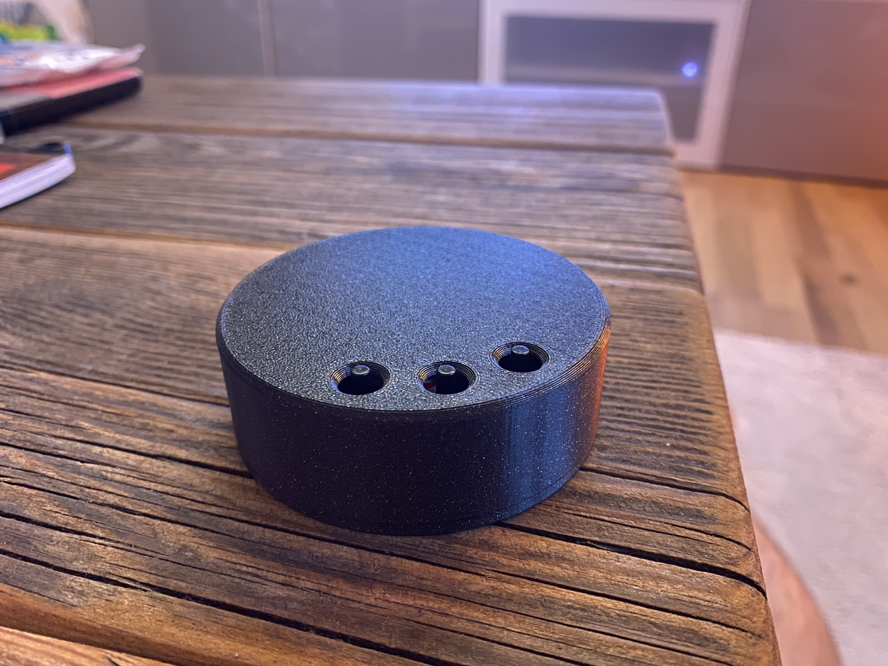
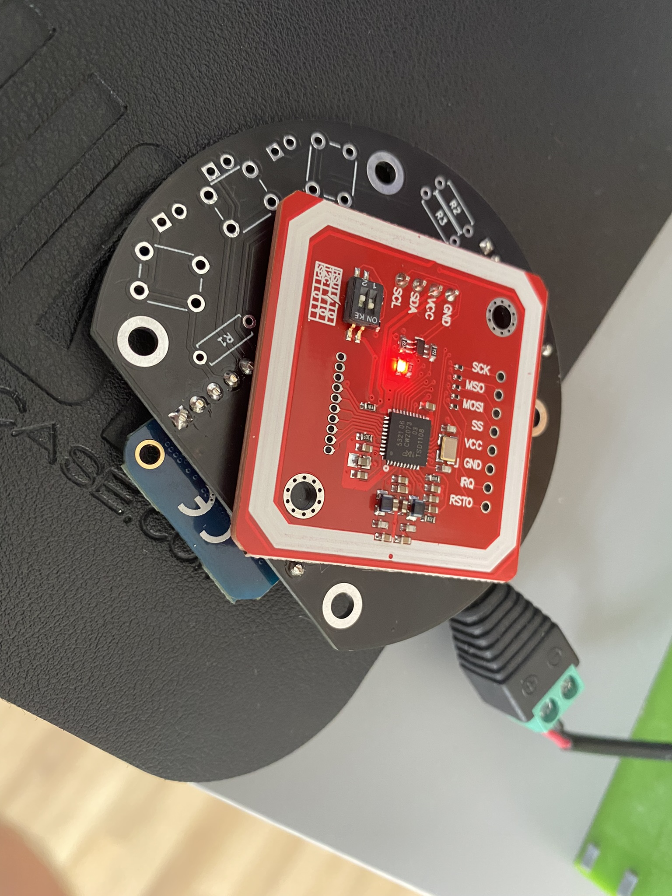
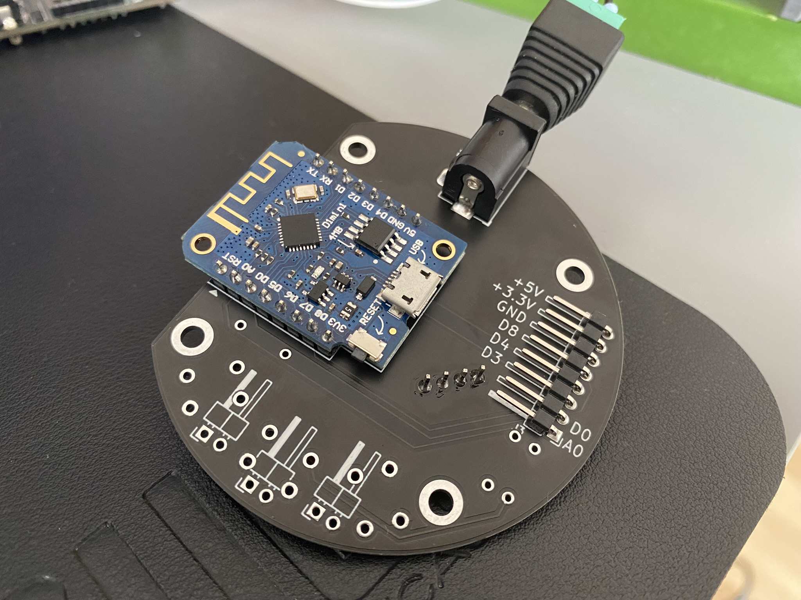
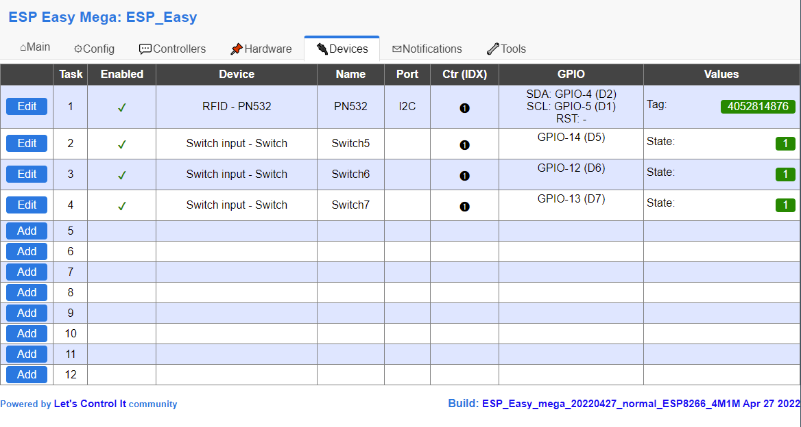

Shield: [![CC BY-NC-SA 4.0][cc-by-nc-sa-shield]][cc-by-nc-sa]

This work is licensed under a
[Creative Commons Attribution-NonCommercial-ShareAlike 4.0 International License][cc-by-nc-sa].

[![CC BY-NC-SA 4.0][cc-by-nc-sa-image]][cc-by-nc-sa]

[cc-by-nc-sa]: http://creativecommons.org/licenses/by-nc-sa/4.0/
[cc-by-nc-sa-image]: https://licensebuttons.net/l/by-nc-sa/4.0/88x31.png
[cc-by-nc-sa-shield]: https://img.shields.io/badge/License-CC%20BY--NC--SA%204.0-lightgrey.svg

## Donations / Spenden
If somebody wants to support me for upcoming projects :)  
- PayPal:  
- Amazon Giftcard: https://www.amazon.de/Amazon-Gutschein-per-E-Mail-Amazon/dp/B0054PDOV8 - stefan.riese@me.com

# RFID WiFi Reader
This RFID WiFi Reader is used to read RFID cards or keychain pendant and send the serial number via MQTT. Additionally there is an option to solder 3 tactile push buttons to the PCB for user inputs. 

## Features
- MQTT interface
- Power options: 
  - Barrel jack
  - USB from Wemos
  - Solder of cables to pads
- 3 Buttons for user input
  - 6x6mm tactile push buttons or soldered to pads or 2,54mm dupont connector
- additional pins from ESP for addons

## BOM
|Id|Designator|Package|Quantity|Designation|Comment|
|---|---|---|---|---|---|
|1|SW1,SW3,SW2|SW_PUSH_6mm_H9.5mm|3|SW_Push|optional||
|2|J1|PinHeader_1x04_P2.54mm_Vertical|1|Conn_01x04_Female|PN532||
|3|R2,R1,R3|R_Axial_DIN0207_L6.3mm_D2.5mm_P7.62mm_Horizontal|3|10K|not used||
|4|J3|PinHeader_1x08_P2.54mm_Horizontal|1|Conn_01x08_Female|optional||
|5|JSW3,JSW2,JSW1|PinHeader_1x02_P2.54mm_Horizontal|3|Conn_01x02_Female|optional||
|6|J2|BarrelJack_Horizontal|1|Barrel_Jack|optional||
|7|U1|WEMOS_D1_mini_light|1|WeMos_D1_mini|||

## Wiring diagram
https://github.com/Hasenpups/Wifi_RFID_Reader/blob/main/RFID_Reader.pdf

## Software
https://espeasy.readthedocs.io/

## Pinout
- PN532 module
  - I2C
    - SCL - D1
    - SDA - D2
- Buttons 
  - D4
  - D5
  - D6

## Configuration

## Housing
https://github.com/Hasenpups/Wifi_RFID_Reader/tree/main/Housing
